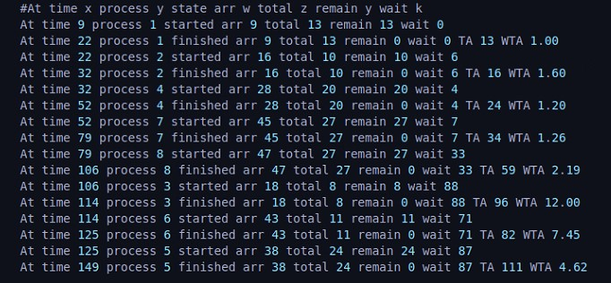
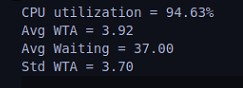
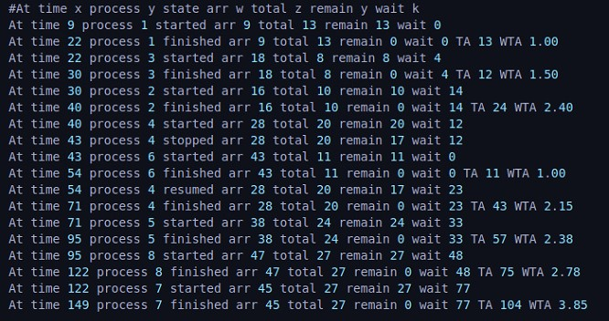
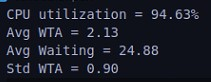
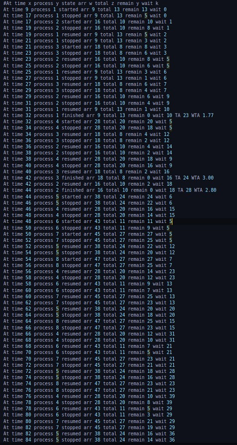
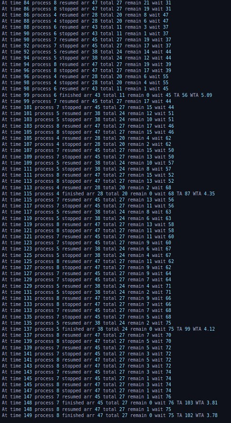
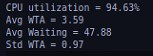

# OS Scheduler
## Phase1

### Data Structures
- **Priority queue**: 
    - HPF algorithm
    - SRTN algorithm
- **Circular queue**:
    - RR algorithm

### Algorithm Explanation
- Process generator parses test case and gets Algorithm to be used in scheduling from the user.
- Process generator forks clock and scheduler processes and passes processes to scheduler when their arrival time comes.
- When scheduler is initialized, it loads the required algorithm interface and creates the PCB.
- Each iteration in scheduler:
  1- Checks if a new process arrived
    - forks and add it to the PCB.
    - Insert it in the running algorithm's data structure according to it's criteria.
  
  2- Updates PCB if a clock cycle passed.
  3- Checks if a preemption is needed according to the running algorithm.
    - Scheduler preempts the running process.
    - Gets next process according to the running algorithm's data structure
    - Updates PCB

### Results
- #### Test Case

- #### **HPF Results**
1- scheduler.log

2- scheduler.perf

- #### **SRTN Results**
1- scheduler.log

2- scheduler.perf

- #### **RR Results**
1- scheduler.log

2- scheduler.perf

### Assumptions
<!---
@TODO Add Assumptions in any of the scheduling algorithms
--->

### Workload Distribution 

| Name              | SEC:   BN:   | Load                    |
|-------------------|------------|------------------------------|
| Ahmed Hesham Eid  | SEC: 1   BN: 9  | Process generator   Scheduler |
| Youssef Walid     |            |                              |
| Ahmed Nasser      |            |                              |
| Abdelrahman Farid |            |                              |

### Time Taken For Tasks

| Task              | Hrs    |
|-------------------|--------|
| Algorithms        | 4 Hrs  |
| Data Structures   | 3 Hrs  |
| Scheduler         | 3 Hrs  |
| Process Generator | 1 Hrs  |
| Debugging         | 10 Hrs |