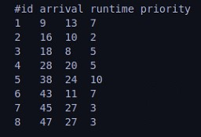
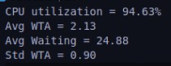

# OS Scheduler Phase1

## Team 1
| Name              | Section   | Bench Number    |
|-------------------|--------|--------|
| Ahmed Nasser      | 1 |  8  | 
| Ahmed Hesham Eid  | 1 |  9  | 
| Abdelrahman Farid | 1 |  34 | 
| Youssef Walid     | 2 |  34 | 

## Data Structures
- **Priority queue**: 
    - HPF algorithm
    - SRTN algorithm
- **Circular queue**:
    - RR algorithm

## Algorithm Explanation
- Process generator parses test case and gets Algorithm to be used in scheduling from the user.
- Process generator forks clock and scheduler processes and passes processes to scheduler when their arrival time comes.
- When scheduler is initialized, it loads the required algorithm interface and creates the PCB.
- Each iteration in scheduler:
  
  1. Checks if a new process arrived
       - Forks and add it to the PCB.
       - Insert it in the running algorithm's data structure according to it's criteria.
  
  2. Updates PCB if a clock cycle passed.
  3. Checks if a preemption is needed according to the running algorithm.
       - Scheduler preempts the running process.
       - Gets next process according to the running algorithm's data structure
       - Updates PCB
  4. Whenever a process finishes or is launched, the algorithm tries to schedule it if it is fit, this is used instead of polling each time inside the while loop and slowing the scheduler down.

## Results
- ### Test Case

- ### **HPF Results**
1. scheduler.log

2. scheduler.perf

- ### **SRTN Results**
1. scheduler.log

2. scheduler.perf

- ### **RR with Q=2 Results**
1. scheduler.log

2. scheduler.perf

## Assumptions
- RR
    - If a process arrives at the time the RR quanta ends, the preemption happens before that process enters, i.e. if there is one process only and the quanta ends when another one arrives, we continue running the one process only.
  
- HPF
  - If many processes have same priority, they are scheduled according to the ordering of the min-heap, that is, the one inserted first in the min-heap will be scheduled first, but after that, we start from the last process that arrived. This behaviour can be called 'random' but it is predictible in some way.
  
- SRTN
  - If a process arrives that has the same remaining time as the currently running one, no preemption happens.
  - If more than one process have the same remaining time, when one is scheduled, we pick them in a min-heap fashion. i.e. the processes are scheduled last arrived to first arrived.

### Workload Distribution 

| Name              | SEC:   BN:   | Load                    |
|-------------------|-----------------|-------------------------|
| Ahmed Nasser      | SEC: 1   BN: 8  | PCB Table   Scheduler                       |
| Ahmed Hesham Eid  | SEC: 1   BN: 9  | Process generator   Scheduler               |
| Abdelrahman Farid | SEC: 1   BN: 34 | Circular Queue   Scheduler   RR and SRTN |
| Youssef Walid     | SEC: 2   BN: 34 | Priority Queue   Scheduler   HPF         |

### Time Taken For Tasks

| Task              | Hrs    |
|-------------------|--------|
| Algorithms        | 4 Hrs  |
| Data Structures   | 3 Hrs  |
| Scheduler         | 3 Hrs  |
| Process Generator | 1 Hrs  |
| Debugging         | 10 Hrs |

# Memory Management

## Algorithm Explanation
  - When a process arrives, we insert it in a 'waiting' queue.
  - According to the scheduling algorithm, we check that waiting queue for candidate processes to enter our scheduling algorithm's datastructure, i.e:
    - In SRTN: if any process in the waiting queue has less remaining time than the currently running process, it enters the SRTN's circular queue, however the older process remains allocated inthe memory.
    - In RR: if there is a free space, the first process in the waiting queue is moved to the RR's circular queue instantly, as we will schedule it sooner or later in that same order.
    - In HPF: after the currently running process ends, we check the waiting queue for the best fit for the HPF (the one with the highest priority), this allows us to not allocate memory for unfit processes too early.
  

## Workload Distribution 

| Name              | SEC:   BN:   | Load                    |
|-------------------|-----------------|-------------------------|
| Ahmed Nasser      | SEC: 1   BN: 8  | PCB Table   Scheduler      Memory Management Design                    |
| Ahmed Hesham Eid  | SEC: 1   BN: 9  | Process generator   Scheduler   Memory Management Design              |
| Abdelrahman Farid | SEC: 1   BN: 34 | Circular Queue   Scheduler   RR and SRTN   Buddy System v1   Memory Management Design |
| Youssef Walid     | SEC: 2   BN: 34 | Priority Queue   Scheduler   HPF   Buddy System v2   Waiting queue implementation   Memory Management Design      |